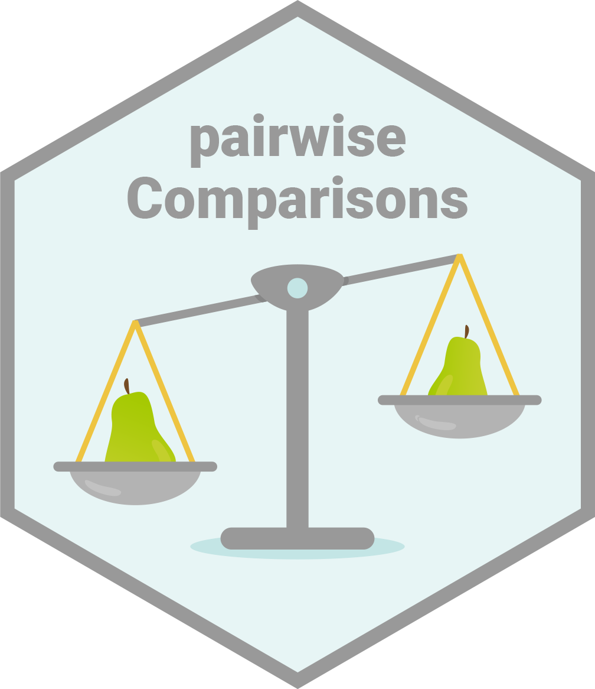

  <!-- README.md is generated from README.Rmd. Please edit that file -->

```{r, echo = FALSE}
# pretty printing for the tibble
options(
  tibble.width = Inf,
  pillar.bold = TRUE,
  pillar.neg = TRUE,
  pillar.subtle_num = TRUE,
  pillar.min_chars = Inf
)

knitr::opts_chunk$set(
  collapse = TRUE,
  dpi = 300,
  out.width = "100%",
  comment = "#>",
  warning = FALSE,
  message = FALSE,
  fig.path = "man/figures/README-"
)
```

# `{pairwiseComparisons}`: Multiple Pairwise Comparison Tests

[](https://lifecycle.r-lib.org/articles/stages.html)
[](https://github.com/IndrajeetPatil/pairwiseComparisons)
[](https://github.com/IndrajeetPatil/pairwiseComparisons/actions)

# Introduction 

[`{pairwiseComparisons}`](https://indrajeetpatil.github.io/pairwiseComparisons/)
provides a tidy data friendly way to carry out pairwise comparison tests.

It currently supports *post hoc* multiple pairwise comparisons tests for both
between-subjects and within-subjects one-way analysis of variance designs. For
both of these designs, parametric, non-parametric, robust, and Bayesian
statistical tests are available.

# Installation

Type | Source | Command
---|---|---
Release | CRAN | `install.packages("pairwiseComparisons")`
Development | GitHub | `remotes::install_github("IndrajeetPatil/pairwiseComparisons")`

Linux users may encounter some installation problems. In particular, the
`{pairwiseComparisons}` package depends on the `PMCMRplus` package.

```
ERROR: dependencies ‘gmp’, ‘Rmpfr’ are not available for package ‘PMCMRplus’
ERROR: dependency ‘pairwiseComparisons’ is not available for package ‘ggstatsplot’
```

This means that your operating system lacks `gmp` and `Rmpfr` libraries.

If you use `Ubuntu`, you can install these dependencies:

```
sudo apt-get install libgmp3-dev
sudo apt-get install libmpfr-dev
```

The following `README` file briefly describes the installation procedure:
<https://CRAN.R-project.org/package=PMCMRplus/readme/README.html>

# Summary of types of statistical analyses

Following table contains a brief summary of the currently supported pairwise
comparison tests-

## Between-subjects design

Type | Equal variance? | Test | *p*-value adjustment? | Function used
----------- | --- | ------------------------- | --- | -----
Parametric | No | Games-Howell test | ✅ | `stats::pairwise.t.test`
Parametric | Yes | Student's *t*-test | ✅ | `PMCMRplus::gamesHowellTest`
Non-parametric | No | Dunn test | ✅ | `PMCMRplus::kwAllPairsDunnTest`
Robust | No | Yuen's trimmed means test | ✅ | `WRS2::lincon`
Bayesian | `NA` | Student's *t*-test | `NA` | `BayesFactor::ttestBF`

## Within-subjects design

Type | Test | *p*-value adjustment? | Function used
----------- | ---------------------------- | --- | -----
Parametric | Student's *t*-test | ✅ | `stats::pairwise.t.test`
Non-parametric | Durbin-Conover test | ✅ | `PMCMRplus::durbinAllPairsTest` 
Robust | Yuen's trimmed means test | ✅ | `WRS2::rmmcp`
Bayesian | Student's *t*-test | `NA` | `BayesFactor::ttestBF`

# Examples

Here we will see specific examples of how to use this function for different
types of

  - designs (between or within subjects)
  - statistics (parametric, non-parametric, robust, Bayesian)
  - *p*-value adjustment methods

## Between-subjects design

```{r}
# for reproducibility
set.seed(123)
library(pairwiseComparisons)
library(statsExpressions) # for data

# parametric
# if `var.equal = TRUE`, then Student's *t*-test will be run
pairwise_comparisons(
  data = ggplot2::msleep,
  x = vore,
  y = brainwt,
  type = "parametric",
  var.equal = TRUE,
  paired = FALSE,
  p.adjust.method = "bonferroni"
)

# if `var.equal = FALSE`, then Games-Howell test will be run
pairwise_comparisons(
  data = ggplot2::msleep,
  x = vore,
  y = brainwt,
  type = "parametric",
  var.equal = FALSE,
  paired = FALSE,
  p.adjust.method = "bonferroni"
)

# non-parametric
pairwise_comparisons(
  data = ggplot2::msleep,
  x = vore,
  y = brainwt,
  type = "nonparametric",
  paired = FALSE,
  p.adjust.method = "none"
)

# robust
pairwise_comparisons(
  data = ggplot2::msleep,
  x = vore,
  y = brainwt,
  type = "robust",
  paired = FALSE,
  p.adjust.method = "fdr"
)

# Bayesian
pairwise_comparisons(
  data = ggplot2::msleep,
  x = vore,
  y = brainwt,
  type = "bayes",
  paired = FALSE
)
```


## Within-subjects design

```{r}
# for reproducibility
set.seed(123)

# parametric
pairwise_comparisons(
  data = bugs_long,
  x = condition,
  y = desire,
  subject.id = subject,
  type = "parametric",
  paired = TRUE,
  p.adjust.method = "BH"
)

# non-parametric
pairwise_comparisons(
  data = bugs_long,
  x = condition,
  y = desire,
  subject.id = subject,
  type = "nonparametric",
  paired = TRUE,
  p.adjust.method = "BY"
)

# robust
pairwise_comparisons(
  data = bugs_long,
  x = condition,
  y = desire,
  subject.id = subject,
  type = "robust",
  paired = TRUE,
  p.adjust.method = "hommel"
)

# Bayesian
pairwise_comparisons(
  data = bugs_long,
  x = condition,
  y = desire,
  subject.id = subject,
  type = "bayes",
  paired = TRUE,
  bf.prior = 0.77
)
```

# Using `{pairwiseComparisons}` with `ggsignif`

## Example-1: between-subjects

```{r ggsignif, fig.height=5}
# needed libraries
set.seed(123)
library(ggplot2)
library(pairwiseComparisons)
library(ggsignif)

# converting to factor
mtcars$cyl <- as.factor(mtcars$cyl)

# creating a basic plot
p <- ggplot(mtcars, aes(cyl, wt)) +
  geom_boxplot()

# using `{pairwiseComparisons}` package to create a dataframe with results
set.seed(123)
(df <-
  pairwise_comparisons(mtcars, cyl, wt) %>%
  dplyr::mutate(groups = purrr::pmap(.l = list(group1, group2), .f = c)) %>%
  dplyr::arrange(group1))

# using `geom_signif` to display results
# (note that you can choose not to display all comparisons)
p +
  ggsignif::geom_signif(
    comparisons = list(df$groups[[1]]),
    annotations = df$label[[1]],
    test = NULL,
    na.rm = TRUE,
    parse = TRUE
  )
```

## Example-2: within-subjects

```{r ggsignif2}
# needed libraries
library(ggplot2)
library(pairwiseComparisons)
library(ggsignif)

# creating a basic plot
p <- ggplot(WRS2::WineTasting, aes(Wine, Taste)) +
  geom_boxplot()

# using `{pairwiseComparisons}` package to create a dataframe with results
set.seed(123)
(df <-
  pairwise_comparisons(
    WRS2::WineTasting,
    Wine,
    Taste,
    subject.id = Taster,
    type = "bayes",
    paired = TRUE
  ) %>%
  dplyr::mutate(groups = purrr::pmap(.l = list(group1, group2), .f = c)) %>%
  dplyr::arrange(group1))

# using `geom_signif` to display results
p +
  ggsignif::geom_signif(
    comparisons = df$groups,
    map_signif_level = TRUE,
    tip_length = 0.01,
    y_position = c(6.5, 6.65, 6.8),
    annotations = df$label,
    test = NULL,
    na.rm = TRUE,
    parse = TRUE
  )
```

# Acknowledgments

The hexsticker was generously designed by Sarah Otterstetter (Max Planck
Institute for Human Development, Berlin). 

