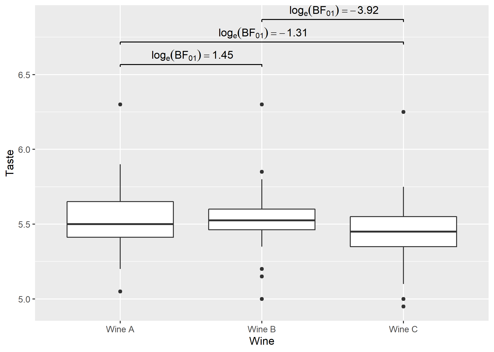

<!-- README.md is generated from README.Rmd. Please edit that file -->

# `{pairwiseComparisons}`: Multiple Pairwise Comparison Tests

[](https://CRAN.R-project.org/package=pairwiseComparisons)
[](https://cran.r-project.org/web/checks/check_results_pairwiseComparisons.html)
[](https://github.com/IndrajeetPatil/pairwiseComparisons)
[](https://github.com/IndrajeetPatil/pairwiseComparisons/actions)
[](https://lifecycle.r-lib.org/articles/stages.html)
[](https://CRAN.R-project.org/package=pairwiseComparisons)
[](https://CRAN.R-project.org/package=pairwiseComparisons)

# Introduction 

[`{pairwiseComparisons}`](https://indrajeetpatil.github.io/pairwiseComparisons/)
provides a tidy data friendly way to carry out pairwise comparison
tests.

It currently supports *post hoc* multiple pairwise comparisons tests for
both between-subjects and within-subjects one-way analysis of variance
designs. For both of these designs, parametric, non-parametric, robust,
and Bayesian statistical tests are available.

# Installation

| Type        | Source | Command                                                         |
|-------------|--------|-----------------------------------------------------------------|
| Release     | CRAN   | `install.packages("pairwiseComparisons")`                       |
| Development | GitHub | `remotes::install_github("IndrajeetPatil/pairwiseComparisons")` |

Linux users may encounter some installation problems. In particular, the
`{pairwiseComparisons}` package depends on the `PMCMRplus` package.

    ERROR: dependencies ‘gmp’, ‘Rmpfr’ are not available for package ‘PMCMRplus’
    ERROR: dependency ‘pairwiseComparisons’ is not available for package ‘ggstatsplot’

This means that your operating system lacks `gmp` and `Rmpfr` libraries.

If you use `Ubuntu`, you can install these dependencies:

    sudo apt-get install libgmp3-dev
    sudo apt-get install libmpfr-dev

The following `README` file briefly describes the installation
procedure:
<https://CRAN.R-project.org/package=PMCMRplus/readme/README.html>

# Summary of types of statistical analyses

Following table contains a brief summary of the currently supported
pairwise comparison tests-

## Between-subjects design

| Type           | Equal variance? | Test                      | *p*-value adjustment? | Function used                   |
|----------------|-----------------|---------------------------|-----------------------|---------------------------------|
| Parametric     | No              | Games-Howell test         | ✅                     | `stats::pairwise.t.test`        |
| Parametric     | Yes             | Student’s *t*-test        | ✅                     | `PMCMRplus::gamesHowellTest`    |
| Non-parametric | No              | Dunn test                 | ✅                     | `PMCMRplus::kwAllPairsDunnTest` |
| Robust         | No              | Yuen’s trimmed means test | ✅                     | `WRS2::lincon`                  |
| Bayesian       | `NA`            | Student’s *t*-test        | `NA`                  | `BayesFactor::ttestBF`          |

## Within-subjects design

| Type           | Test                      | *p*-value adjustment? | Function used                   |
|----------------|---------------------------|-----------------------|---------------------------------|
| Parametric     | Student’s *t*-test        | ✅                     | `stats::pairwise.t.test`        |
| Non-parametric | Durbin-Conover test       | ✅                     | `PMCMRplus::durbinAllPairsTest` |
| Robust         | Yuen’s trimmed means test | ✅                     | `WRS2::rmmcp`                   |
| Bayesian       | Student’s *t*-test        | `NA`                  | `BayesFactor::ttestBF`          |

# Examples

Here we will see specific examples of how to use this function for
different types of

-   designs (between or within subjects)
-   statistics (parametric, non-parametric, robust, Bayesian)
-   *p*-value adjustment methods

## Between-subjects design

``` r
# for reproducibility
set.seed(123)
library(pairwiseComparisons)
library(statsExpressions) # for data

# parametric
# if `var.equal = TRUE`, then Student's *t*-test will be run
pairwise_comparisons(
  data = ggplot2::msleep,
  x = vore,
  y = brainwt,
  type = "parametric",
  var.equal = TRUE,
  paired = FALSE,
  p.adjust.method = "bonferroni"
)
#> # A tibble: 6 x 6
#>   group1  group2  p.value test.details     p.value.adjustment
#>   <chr>   <chr>     <dbl> <chr>            <chr>             
#> 1 carni   herbi     1     Student's t-test Bonferroni        
#> 2 carni   insecti   1     Student's t-test Bonferroni        
#> 3 carni   omni      1     Student's t-test Bonferroni        
#> 4 herbi   insecti   1     Student's t-test Bonferroni        
#> 5 herbi   omni      0.979 Student's t-test Bonferroni        
#> 6 insecti omni      1     Student's t-test Bonferroni        
#>   label                                        
#>   <chr>                                        
#> 1 list(~italic(p)[Bonferroni-corrected]==1.000)
#> 2 list(~italic(p)[Bonferroni-corrected]==1.000)
#> 3 list(~italic(p)[Bonferroni-corrected]==1.000)
#> 4 list(~italic(p)[Bonferroni-corrected]==1.000)
#> 5 list(~italic(p)[Bonferroni-corrected]==0.979)
#> 6 list(~italic(p)[Bonferroni-corrected]==1.000)

# if `var.equal = FALSE`, then Games-Howell test will be run
pairwise_comparisons(
  data = ggplot2::msleep,
  x = vore,
  y = brainwt,
  type = "parametric",
  var.equal = FALSE,
  paired = FALSE,
  p.adjust.method = "bonferroni"
)
#> # A tibble: 6 x 11
#>   group1  group2  statistic p.value alternative method            distribution
#>   <chr>   <chr>       <dbl>   <dbl> <chr>       <chr>             <chr>       
#> 1 carni   herbi        2.17       1 two.sided   Games-Howell test q           
#> 2 carni   insecti     -2.17       1 two.sided   Games-Howell test q           
#> 3 carni   omni         1.10       1 two.sided   Games-Howell test q           
#> 4 herbi   insecti     -2.41       1 two.sided   Games-Howell test q           
#> 5 herbi   omni        -1.87       1 two.sided   Games-Howell test q           
#> 6 insecti omni         2.19       1 two.sided   Games-Howell test q           
#>   p.adjustment test.details      p.value.adjustment
#>   <chr>        <chr>             <chr>             
#> 1 none         Games-Howell test Bonferroni        
#> 2 none         Games-Howell test Bonferroni        
#> 3 none         Games-Howell test Bonferroni        
#> 4 none         Games-Howell test Bonferroni        
#> 5 none         Games-Howell test Bonferroni        
#> 6 none         Games-Howell test Bonferroni        
#>   label                                        
#>   <chr>                                        
#> 1 list(~italic(p)[Bonferroni-corrected]==1.000)
#> 2 list(~italic(p)[Bonferroni-corrected]==1.000)
#> 3 list(~italic(p)[Bonferroni-corrected]==1.000)
#> 4 list(~italic(p)[Bonferroni-corrected]==1.000)
#> 5 list(~italic(p)[Bonferroni-corrected]==1.000)
#> 6 list(~italic(p)[Bonferroni-corrected]==1.000)

# non-parametric
pairwise_comparisons(
  data = ggplot2::msleep,
  x = vore,
  y = brainwt,
  type = "nonparametric",
  paired = FALSE,
  p.adjust.method = "none"
)
#> # A tibble: 6 x 11
#>   group1  group2  statistic p.value alternative method               
#>   <chr>   <chr>       <dbl>   <dbl> <chr>       <chr>                
#> 1 carni   herbi       0.582  0.561  two.sided   Dunn's all-pairs test
#> 2 carni   insecti     1.88   0.0595 two.sided   Dunn's all-pairs test
#> 3 carni   omni        1.14   0.254  two.sided   Dunn's all-pairs test
#> 4 herbi   insecti     1.63   0.102  two.sided   Dunn's all-pairs test
#> 5 herbi   omni        0.717  0.474  two.sided   Dunn's all-pairs test
#> 6 insecti omni        1.14   0.254  two.sided   Dunn's all-pairs test
#>   distribution p.adjustment test.details p.value.adjustment
#>   <chr>        <chr>        <chr>        <chr>             
#> 1 z            none         Dunn test    None              
#> 2 z            none         Dunn test    None              
#> 3 z            none         Dunn test    None              
#> 4 z            none         Dunn test    None              
#> 5 z            none         Dunn test    None              
#> 6 z            none         Dunn test    None              
#>   label                               
#>   <chr>                               
#> 1 list(~italic(p)[uncorrected]==0.561)
#> 2 list(~italic(p)[uncorrected]==0.060)
#> 3 list(~italic(p)[uncorrected]==0.254)
#> 4 list(~italic(p)[uncorrected]==0.102)
#> 5 list(~italic(p)[uncorrected]==0.474)
#> 6 list(~italic(p)[uncorrected]==0.254)

# robust
pairwise_comparisons(
  data = ggplot2::msleep,
  x = vore,
  y = brainwt,
  type = "robust",
  paired = FALSE,
  p.adjust.method = "fdr"
)
#> # A tibble: 6 x 10
#>   group1  group2  estimate conf.level conf.low conf.high p.value
#>   <chr>   <chr>      <dbl>      <dbl>    <dbl>     <dbl>   <dbl>
#> 1 carni   herbi   -0.0323        0.95  -0.248     0.184    0.790
#> 2 carni   insecti  0.0451        0.95  -0.0484    0.139    0.552
#> 3 carni   omni     0.00520       0.95  -0.114     0.124    0.898
#> 4 herbi   insecti  0.0774        0.95  -0.133     0.288    0.552
#> 5 herbi   omni     0.0375        0.95  -0.182     0.257    0.790
#> 6 insecti omni    -0.0399        0.95  -0.142     0.0625   0.552
#>   test.details              p.value.adjustment
#>   <chr>                     <chr>             
#> 1 Yuen's trimmed means test FDR               
#> 2 Yuen's trimmed means test FDR               
#> 3 Yuen's trimmed means test FDR               
#> 4 Yuen's trimmed means test FDR               
#> 5 Yuen's trimmed means test FDR               
#> 6 Yuen's trimmed means test FDR               
#>   label                                 
#>   <chr>                                 
#> 1 list(~italic(p)[FDR-corrected]==0.790)
#> 2 list(~italic(p)[FDR-corrected]==0.552)
#> 3 list(~italic(p)[FDR-corrected]==0.898)
#> 4 list(~italic(p)[FDR-corrected]==0.552)
#> 5 list(~italic(p)[FDR-corrected]==0.790)
#> 6 list(~italic(p)[FDR-corrected]==0.552)

# Bayesian
pairwise_comparisons(
  data = ggplot2::msleep,
  x = vore,
  y = brainwt,
  type = "bayes",
  paired = FALSE
)
#> # A tibble: 6 x 18
#>   group1  group2  term       estimate conf.level conf.low conf.high    pd
#>   <chr>   <chr>   <chr>         <dbl>      <dbl>    <dbl>     <dbl> <dbl>
#> 1 carni   herbi   Difference   0.376        0.95   -0.525    1.33   0.800
#> 2 carni   insecti Difference  -0.0348       0.95   -0.127    0.0425 0.818
#> 3 carni   omni    Difference   0.0440       0.95   -0.139    0.239  0.693
#> 4 herbi   insecti Difference  -0.394        0.95   -1.61     0.775  0.758
#> 5 herbi   omni    Difference  -0.362        0.95   -1.06     0.345  0.859
#> 6 insecti omni    Difference   0.0762       0.95   -0.153    0.339  0.732
#>   rope.percentage prior.distribution prior.location prior.scale  bf10
#>             <dbl> <chr>                       <dbl>       <dbl> <dbl>
#> 1           0.171 cauchy                          0       0.707 0.540
#> 2           0.134 cauchy                          0       0.707 0.718
#> 3           0.236 cauchy                          0       0.707 0.427
#> 4           0.166 cauchy                          0       0.707 0.540
#> 5           0.162 cauchy                          0       0.707 0.571
#> 6           0.161 cauchy                          0       0.707 0.545
#>   method          log_e_bf10 expression label                        
#>   <chr>                <dbl> <list>     <chr>                        
#> 1 Bayesian t-test     -0.617 <language> list(~log[e](BF['01'])==0.62)
#> 2 Bayesian t-test     -0.332 <language> list(~log[e](BF['01'])==0.33)
#> 3 Bayesian t-test     -0.851 <language> list(~log[e](BF['01'])==0.85)
#> 4 Bayesian t-test     -0.616 <language> list(~log[e](BF['01'])==0.62)
#> 5 Bayesian t-test     -0.560 <language> list(~log[e](BF['01'])==0.56)
#> 6 Bayesian t-test     -0.606 <language> list(~log[e](BF['01'])==0.61)
#>   test.details    
#>   <chr>           
#> 1 Student's t-test
#> 2 Student's t-test
#> 3 Student's t-test
#> 4 Student's t-test
#> 5 Student's t-test
#> 6 Student's t-test
```

## Within-subjects design

``` r
# for reproducibility
set.seed(123)

# parametric
pairwise_comparisons(
  data = bugs_long,
  x = condition,
  y = desire,
  subject.id = subject,
  type = "parametric",
  paired = TRUE,
  p.adjust.method = "BH"
)
#> # A tibble: 6 x 6
#>   group1 group2  p.value test.details     p.value.adjustment
#>   <chr>  <chr>     <dbl> <chr>            <chr>             
#> 1 HDHF   HDLF   1.06e- 3 Student's t-test FDR               
#> 2 HDHF   LDHF   7.02e- 2 Student's t-test FDR               
#> 3 HDHF   LDLF   3.95e-12 Student's t-test FDR               
#> 4 HDLF   LDHF   6.74e- 2 Student's t-test FDR               
#> 5 HDLF   LDLF   1.99e- 3 Student's t-test FDR               
#> 6 LDHF   LDLF   6.66e- 9 Student's t-test FDR               
#>   label                                    
#>   <chr>                                    
#> 1 list(~italic(p)[FDR-corrected]==0.001)   
#> 2 list(~italic(p)[FDR-corrected]==0.070)   
#> 3 list(~italic(p)[FDR-corrected]==3.95e-12)
#> 4 list(~italic(p)[FDR-corrected]==0.067)   
#> 5 list(~italic(p)[FDR-corrected]==0.002)   
#> 6 list(~italic(p)[FDR-corrected]==6.66e-09)

# non-parametric
pairwise_comparisons(
  data = bugs_long,
  x = condition,
  y = desire,
  subject.id = subject,
  type = "nonparametric",
  paired = TRUE,
  p.adjust.method = "BY"
)
#> # A tibble: 6 x 11
#>   group1 group2 statistic  p.value alternative
#>   <chr>  <chr>      <dbl>    <dbl> <chr>      
#> 1 HDHF   HDLF        4.78 1.44e- 5 two.sided  
#> 2 HDHF   LDHF        2.44 4.47e- 2 two.sided  
#> 3 HDHF   LDLF        8.01 5.45e-13 two.sided  
#> 4 HDLF   LDHF        2.34 4.96e- 2 two.sided  
#> 5 HDLF   LDLF        3.23 5.05e- 3 two.sided  
#> 6 LDHF   LDLF        5.57 4.64e- 7 two.sided  
#>   method                                                                
#>   <chr>                                                                 
#> 1 Durbin's all-pairs test for a two-way balanced incomplete block design
#> 2 Durbin's all-pairs test for a two-way balanced incomplete block design
#> 3 Durbin's all-pairs test for a two-way balanced incomplete block design
#> 4 Durbin's all-pairs test for a two-way balanced incomplete block design
#> 5 Durbin's all-pairs test for a two-way balanced incomplete block design
#> 6 Durbin's all-pairs test for a two-way balanced incomplete block design
#>   distribution p.adjustment test.details        p.value.adjustment
#>   <chr>        <chr>        <chr>               <chr>             
#> 1 t            none         Durbin-Conover test BY                
#> 2 t            none         Durbin-Conover test BY                
#> 3 t            none         Durbin-Conover test BY                
#> 4 t            none         Durbin-Conover test BY                
#> 5 t            none         Durbin-Conover test BY                
#> 6 t            none         Durbin-Conover test BY                
#>   label                                   
#>   <chr>                                   
#> 1 list(~italic(p)[BY-corrected]==1.44e-05)
#> 2 list(~italic(p)[BY-corrected]==0.045)   
#> 3 list(~italic(p)[BY-corrected]==5.45e-13)
#> 4 list(~italic(p)[BY-corrected]==0.050)   
#> 5 list(~italic(p)[BY-corrected]==0.005)   
#> 6 list(~italic(p)[BY-corrected]==4.64e-07)

# robust
pairwise_comparisons(
  data = bugs_long,
  x = condition,
  y = desire,
  subject.id = subject,
  type = "robust",
  paired = TRUE,
  p.adjust.method = "hommel"
)
#> # A tibble: 6 x 11
#>   group1 group2 estimate conf.level conf.low conf.high     p.value  p.crit
#>   <chr>  <chr>     <dbl>      <dbl>    <dbl>     <dbl>       <dbl>   <dbl>
#> 1 HDHF   HDLF      1.03        0.95   0.140      1.92  0.00999     0.0127 
#> 2 HDHF   LDHF      0.454       0.95  -0.104      1.01  0.0520      0.025  
#> 3 HDHF   LDLF      1.95        0.95   1.09       2.82  0.000000564 0.00851
#> 4 HDLF   LDHF     -0.676       0.95  -1.61       0.256 0.0520      0.05   
#> 5 HDLF   LDLF      0.889       0.95   0.0244     1.75  0.0203      0.0169 
#> 6 LDHF   LDLF      1.35        0.95   0.560      2.14  0.000102    0.0102 
#>   test.details              p.value.adjustment
#>   <chr>                     <chr>             
#> 1 Yuen's trimmed means test Hommel            
#> 2 Yuen's trimmed means test Hommel            
#> 3 Yuen's trimmed means test Hommel            
#> 4 Yuen's trimmed means test Hommel            
#> 5 Yuen's trimmed means test Hommel            
#> 6 Yuen's trimmed means test Hommel            
#>   label                                       
#>   <chr>                                       
#> 1 list(~italic(p)[Hommel-corrected]==0.010)   
#> 2 list(~italic(p)[Hommel-corrected]==0.052)   
#> 3 list(~italic(p)[Hommel-corrected]==5.64e-07)
#> 4 list(~italic(p)[Hommel-corrected]==0.052)   
#> 5 list(~italic(p)[Hommel-corrected]==0.020)   
#> 6 list(~italic(p)[Hommel-corrected]==1.02e-04)

# Bayesian
pairwise_comparisons(
  data = bugs_long,
  x = condition,
  y = desire,
  subject.id = subject,
  type = "bayes",
  paired = TRUE,
  bf.prior = 0.77
)
#> # A tibble: 6 x 18
#>   group1 group2 term       estimate conf.level conf.low conf.high    pd
#>   <chr>  <chr>  <chr>         <dbl>      <dbl>    <dbl>     <dbl> <dbl>
#> 1 HDHF   HDLF   Difference   -1.10        0.95  -1.73     -0.492  1    
#> 2 HDHF   LDHF   Difference   -0.465       0.95  -0.969     0.0406 0.962
#> 3 HDHF   LDLF   Difference   -2.13        0.95  -2.64     -1.63   1    
#> 4 HDLF   LDHF   Difference    0.652       0.95  -0.0362    1.32   0.971
#> 5 HDLF   LDLF   Difference   -0.983       0.95  -1.60     -0.423  0.999
#> 6 LDHF   LDLF   Difference   -1.67        0.95  -2.14     -1.14   1    
#>   rope.percentage prior.distribution prior.location prior.scale     bf10
#>             <dbl> <chr>                       <dbl>       <dbl>    <dbl>
#> 1           0     cauchy                          0        0.77 3.95e+ 1
#> 2           0.170 cauchy                          0        0.77 5.42e- 1
#> 3           0     cauchy                          0        0.77 1.22e+10
#> 4           0.162 cauchy                          0        0.77 6.50e- 1
#> 5           0     cauchy                          0        0.77 1.72e+ 1
#> 6           0     cauchy                          0        0.77 4.78e+ 6
#>   method          log_e_bf10 expression label                          
#>   <chr>                <dbl> <list>     <chr>                          
#> 1 Bayesian t-test      3.68  <language> list(~log[e](BF['01'])==-3.68) 
#> 2 Bayesian t-test     -0.612 <language> list(~log[e](BF['01'])==0.61)  
#> 3 Bayesian t-test     23.2   <language> list(~log[e](BF['01'])==-23.22)
#> 4 Bayesian t-test     -0.430 <language> list(~log[e](BF['01'])==0.43)  
#> 5 Bayesian t-test      2.84  <language> list(~log[e](BF['01'])==-2.84) 
#> 6 Bayesian t-test     15.4   <language> list(~log[e](BF['01'])==-15.38)
#>   test.details    
#>   <chr>           
#> 1 Student's t-test
#> 2 Student's t-test
#> 3 Student's t-test
#> 4 Student's t-test
#> 5 Student's t-test
#> 6 Student's t-test
```

# Using `{pairwiseComparisons}` with `ggsignif`

## Example-1: between-subjects

``` r
# needed libraries
set.seed(123)
library(ggplot2)
library(pairwiseComparisons)
library(ggsignif)

# converting to factor
mtcars$cyl <- as.factor(mtcars$cyl)

# creating a basic plot
p <- ggplot(mtcars, aes(cyl, wt)) +
  geom_boxplot()

# using `{pairwiseComparisons}` package to create a dataframe with results
set.seed(123)
(df <-
  pairwise_comparisons(mtcars, cyl, wt) %>%
  dplyr::mutate(groups = purrr::pmap(.l = list(group1, group2), .f = c)) %>%
  dplyr::arrange(group1))
#> # A tibble: 3 x 12
#>   group1 group2 statistic   p.value alternative method            distribution
#>   <chr>  <chr>      <dbl>     <dbl> <chr>       <chr>             <chr>       
#> 1 4      6           5.39 0.00831   two.sided   Games-Howell test q           
#> 2 4      8           9.11 0.0000124 two.sided   Games-Howell test q           
#> 3 6      8           5.12 0.00831   two.sided   Games-Howell test q           
#>   p.adjustment test.details      p.value.adjustment
#>   <chr>        <chr>             <chr>             
#> 1 none         Games-Howell test Holm              
#> 2 none         Games-Howell test Holm              
#> 3 none         Games-Howell test Holm              
#>   label                                      groups   
#>   <chr>                                      <list>   
#> 1 list(~italic(p)[Holm-corrected]==0.008)    <chr [2]>
#> 2 list(~italic(p)[Holm-corrected]==1.24e-05) <chr [2]>
#> 3 list(~italic(p)[Holm-corrected]==0.008)    <chr [2]>

# using `geom_signif` to display results
# (note that you can choose not to display all comparisons)
p +
  ggsignif::geom_signif(
    comparisons = list(df$groups[[1]]),
    annotations = df$label[[1]],
    test = NULL,
    na.rm = TRUE,
    parse = TRUE
  )
```


## Example-2: within-subjects

``` r
# needed libraries
library(ggplot2)
library(pairwiseComparisons)
library(ggsignif)

# creating a basic plot
p <- ggplot(WRS2::WineTasting, aes(Wine, Taste)) +
  geom_boxplot()

# using `{pairwiseComparisons}` package to create a dataframe with results
set.seed(123)
(df <-
  pairwise_comparisons(
    WRS2::WineTasting,
    Wine,
    Taste,
    subject.id = Taster,
    type = "bayes",
    paired = TRUE
  ) %>%
  dplyr::mutate(groups = purrr::pmap(.l = list(group1, group2), .f = c)) %>%
  dplyr::arrange(group1))
#> # A tibble: 3 x 19
#>   group1 group2 term       estimate conf.level conf.low conf.high    pd
#>   <chr>  <chr>  <chr>         <dbl>      <dbl>    <dbl>     <dbl> <dbl>
#> 1 Wine A Wine B Difference -0.00721       0.95  -0.0569    0.0404 0.624
#> 2 Wine A Wine C Difference -0.0766        0.95  -0.140    -0.0144 0.989
#> 3 Wine B Wine C Difference -0.0696        0.95  -0.109    -0.0330 1.00 
#>   rope.percentage prior.distribution prior.location prior.scale   bf10
#>             <dbl> <chr>                       <dbl>       <dbl>  <dbl>
#> 1        0.404    cauchy                          0       0.707  0.235
#> 2        0.000526 cauchy                          0       0.707  3.71 
#> 3        0        cauchy                          0       0.707 50.5  
#>   method          log_e_bf10 expression label                         
#>   <chr>                <dbl> <list>     <chr>                         
#> 1 Bayesian t-test      -1.45 <language> list(~log[e](BF['01'])==1.45) 
#> 2 Bayesian t-test       1.31 <language> list(~log[e](BF['01'])==-1.31)
#> 3 Bayesian t-test       3.92 <language> list(~log[e](BF['01'])==-3.92)
#>   test.details     groups   
#>   <chr>            <list>   
#> 1 Student's t-test <chr [2]>
#> 2 Student's t-test <chr [2]>
#> 3 Student's t-test <chr [2]>

# using `geom_signif` to display results
p +
  ggsignif::geom_signif(
    comparisons = df$groups,
    map_signif_level = TRUE,
    tip_length = 0.01,
    y_position = c(6.5, 6.65, 6.8),
    annotations = df$label,
    test = NULL,
    na.rm = TRUE,
    parse = TRUE
  )
```



# Acknowledgments

The hexsticker was generously designed by Sarah Otterstetter (Max Planck
Institute for Human Development, Berlin).

# Contributing

I’m happy to receive bug reports, suggestions, questions, and (most of
all) contributions to fix problems and add features. I personally prefer
using the `GitHub` issues system over trying to reach out to me in other
ways (personal e-mail, Twitter, etc.). Pull Requests for contributions
are encouraged.

Here are some simple ways in which you can contribute (in the increasing
order of commitment):

-   Read and correct any inconsistencies in the
    [documentation](https://indrajeetpatil.github.io/pairwiseComparisons/)
-   Raise issues about bugs or wanted features
-   Review code
-   Add new functionality

Please note that this project is released with a [Contributor Code of
Conduct](https://github.com/IndrajeetPatil/pairwiseComparisons/blob/master/.github/CODE_OF_CONDUCT.md).
By participating in this project you agree to abide by its terms.
