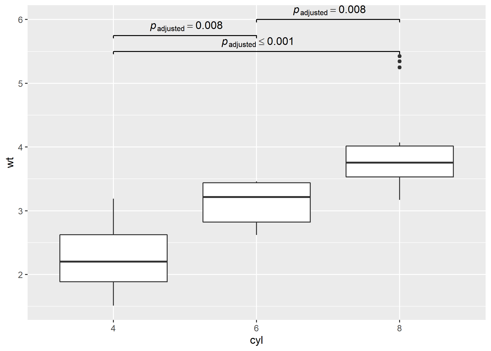

<!-- README.md is generated from README.Rmd. Please edit that file -->

# `pairwiseComparisons`: Multiple Pairwise Comparison Tests

| Package                                                                                                                                                                         | Status                                                                                                                                                                                                       | Usage                                                                                                                                                             | GitHub                                                                                                                                                                         | References                                                                                                                                                                      |
| ------------------------------------------------------------------------------------------------------------------------------------------------------------------------------- | ------------------------------------------------------------------------------------------------------------------------------------------------------------------------------------------------------------ | ----------------------------------------------------------------------------------------------------------------------------------------------------------------- | ------------------------------------------------------------------------------------------------------------------------------------------------------------------------------ | ------------------------------------------------------------------------------------------------------------------------------------------------------------------------------- |
| [](https://CRAN.R-project.org/package=pairwiseComparisons)                                  | [](https://travis-ci.org/IndrajeetPatil/pairwiseComparisons)                                               | [](https://CRAN.R-project.org/package=pairwiseComparisons)     | [](https://github.com/IndrajeetPatil/pairwiseComparisons/)                       | [](https://indrajeetpatil.github.io/pairwiseComparisons/)                          |
| [](https://cran.r-project.org/web/checks/check_results_pairwiseComparisons.html)                      | [](https://ci.appveyor.com/project/IndrajeetPatil/pairwiseComparisons) | [](https://CRAN.R-project.org/package=pairwiseComparisons)   | [](https://github.com/IndrajeetPatil/pairwiseComparisons/)                                                              | [](https://www.rdocumentation.org/packages/pairwiseComparisons)                                       |
| [](https://cran.r-project.org/)                                                                      | [](https://www.tidyverse.org/lifecycle/)                                                                                               | [](https://CRAN.R-project.org/package=pairwiseComparisons) | [](https://github.com/IndrajeetPatil/pairwiseComparisons/issues)                                                | [](https://CRAN.R-project.org/package=pairwiseComparisons/vignettes/)                        |
| [](https://github.com/IndrajeetPatil/pairwiseComparisons) | [](https://coveralls.io/github/IndrajeetPatil/pairwiseComparisons?branch=master)             | [](https://CRAN.R-project.org/package=pairwiseComparisons)  | [](https://github.com/IndrajeetPatil/pairwiseComparisons) | [](https://doi.org/10.5281/zenodo.2074621)                                                                       |
| [](https://www.gnu.org/licenses/gpl-3.0.en.html)                                                                | [](https://codecov.io/gh/IndrajeetPatil/pairwiseComparisons?branch=master)                   | [](http://hits.dwyl.io/IndrajeetPatil/pairwiseComparisons)                                 | [](https://github.com/IndrajeetPatil/pairwiseComparisons/commits/master)            | [](https://github.com/IndrajeetPatil/pairwiseComparisons/commits/master) |
| [](https://CRAN.R-project.org/package=pairwiseComparisons)                                                    | [](https://github.com/IndrajeetPatil/pairwiseComparisons/blob/master/tests/README.md)                        | [](https://gitter.im/pairwiseComparisons/community)                                                   | [](http://www.repostatus.org/#active)                                                                     | [](https://github.com/IndrajeetPatil/pairwiseComparisons/issues)         |

# Introduction

[`pairwiseComparisons`](https://indrajeetpatil.github.io/pairwiseComparisons/)
provides a tidy data friendly way to carry out pairwise comparison
tests.

It currently supports *post hoc* multiple pairwise comparisons tests for
both between-subjects and within-subjects one-way analysis of variance
designs. For both of these designs, parametric, non-parametric, and
robust statistical tests are available.

## Installation

To get the latest, stable `CRAN` release (`0.1.2`):

``` r
install.packages(pkgs = "pairwiseComparisons")
```

You can get the **development** version of the package from `GitHub`
(`0.1.2.9000`). To see what new changes (and bug fixes) have been made
to the package since the last release on `CRAN`, you can check the
detailed log of changes here:
<https://indrajeetpatil.github.io/pairwiseComparisons/news/index.html>

If you are in hurry and want to reduce the time of installation, prefer-

``` r
# needed package to download from GitHub repo
install.packages(pkgs = "remotes")

# downloading the package from GitHub
remotes::install_github(
  repo = "IndrajeetPatil/pairwiseComparisons", # package path on GitHub
  dependencies = FALSE, # assumes you have already installed needed packages
  quick = TRUE # skips docs, demos, and vignettes
)
```

If time is not a constraint-

``` r
remotes::install_github(
  repo = "IndrajeetPatil/pairwiseComparisons", # package path on GitHub
  dependencies = TRUE, # installs packages which pairwiseComparisons depends on
  upgrade_dependencies = TRUE # updates any out of date dependencies
)
```

# Summary of types of statistical analyses

Following table contains a brief summary of the currently supported
pairwise comparison tests-

## Between-subjects design

| Type           | Equal variance? | Test                               | *p*-value adjustment?          |
| -------------- | --------------- | ---------------------------------- | ------------------------------ |
| Parametric     | No              | Games-Howell test                  | <font color="green">Yes</font> |
| Parametric     | Yes             | Student’s *t*-test                 | <font color="green">Yes</font> |
| Non-parametric | No              | Dwass-Steel-Crichtlow-Fligner test | <font color="green">Yes</font> |
| Robust         | No              | Yuen’s trimmed means test          | <font color="green">Yes</font> |
| Bayes Factor   | No              | <font color="red">No</font>        | <font color="red">No</font>    |
| Bayes Factor   | Yes             | <font color="red">No</font>        | <font color="red">No</font>    |

## Within-subjects design

| Type           | Test                        | *p*-value adjustment?          |
| -------------- | --------------------------- | ------------------------------ |
| Parametric     | Student’s *t*-test          | <font color="green">Yes</font> |
| Non-parametric | Durbin-Conover test         | <font color="green">Yes</font> |
| Robust         | Yuen’s trimmed means test   | <font color="green">Yes</font> |
| Bayes Factor   | <font color="red">No</font> | <font color="red">No</font>    |

# Examples

Here we will see specific examples of how to use this function for
different types of

  - designs (between or within subjects)
  - statistics (parametric, non-parametric, robust)
  - *p*-value adjustment methods

## Between-subjects design

``` r
# for reproducibility
set.seed(123)
library(pairwiseComparisons)

# parametric
# if `var.equal = TRUE`, then Student's *t*-test will be run
pairwise_comparisons(
  data = ggplot2::msleep,
  x = vore,
  y = brainwt,
  type = "parametric",
  var.equal = TRUE,
  paired = FALSE,
  p.adjust.method = "bonferroni"
)
#> Note: The parametric pairwise multiple comparisons test used-
#>  Student's t-test.
#>  Adjustment method for p-values: bonferroni
#> # A tibble: 6 x 6
#>   group1  group2  mean.difference p.value significance
#>   <chr>   <chr>             <dbl>   <dbl> <chr>       
#> 1 carni   herbi            0.542    1     ns          
#> 2 carni   insecti         -0.0577   1     ns          
#> 3 carni   omni             0.0665   1     ns          
#> 4 herbi   insecti         -0.600    1     ns          
#> 5 herbi   omni            -0.476    0.979 ns          
#> 6 insecti omni             0.124    1     ns          
#>   label                                
#>   <chr>                                
#> 1 list(~italic(p)['adjusted']== 1.000 )
#> 2 list(~italic(p)['adjusted']== 1.000 )
#> 3 list(~italic(p)['adjusted']== 1.000 )
#> 4 list(~italic(p)['adjusted']== 1.000 )
#> 5 list(~italic(p)['adjusted']== 0.979 )
#> 6 list(~italic(p)['adjusted']== 1.000 )

# if `var.equal = FALSE`, then Games-Howell test will be run
pairwise_comparisons(
  data = ggplot2::msleep,
  x = vore,
  y = brainwt,
  type = "parametric",
  var.equal = FALSE,
  paired = FALSE,
  p.adjust.method = "bonferroni"
)
#> Note: The parametric pairwise multiple comparisons test used-
#>  Games-Howell test.
#>  Adjustment method for p-values: bonferroni
#> # A tibble: 6 x 9
#>   group1 group2  mean.difference    se t.value    df p.value significance
#>   <chr>  <chr>             <dbl> <dbl>   <dbl> <dbl>   <dbl> <chr>       
#> 1 omni   herbi             0.476 0.255   1.32   20.9       1 ns          
#> 2 omni   carni            -0.066 0.061   0.774  21.1       1 ns          
#> 3 omni   insecti          -0.124 0.057   1.55   17.2       1 ns          
#> 4 herbi  carni            -0.542 0.25    1.54   19.4       1 ns          
#> 5 herbi  insecti          -0.6   0.249   1.70   19.1       1 ns          
#> 6 carni  insecti          -0.058 0.027   1.53   10.7       1 ns          
#>   label                                
#>   <chr>                                
#> 1 list(~italic(p)['adjusted']== 1.000 )
#> 2 list(~italic(p)['adjusted']== 1.000 )
#> 3 list(~italic(p)['adjusted']== 1.000 )
#> 4 list(~italic(p)['adjusted']== 1.000 )
#> 5 list(~italic(p)['adjusted']== 1.000 )
#> 6 list(~italic(p)['adjusted']== 1.000 )

# non-parametric
pairwise_comparisons(
  data = ggplot2::msleep,
  x = vore,
  y = brainwt,
  type = "nonparametric",
  paired = FALSE,
  p.adjust.method = "none"
)
#> Note: The nonparametric pairwise multiple comparisons test used-
#>  Dwass-Steel-Crichtlow-Fligner test.
#>  Adjustment method for p-values: none
#> # A tibble: 6 x 6
#>   group1  group2       W p.value significance
#>   <chr>   <chr>    <dbl>   <dbl> <chr>       
#> 1 carni   herbi   -0.8     0.942 ns          
#> 2 carni   insecti -2.36    0.342 ns          
#> 3 carni   omni    -1.72    0.619 ns          
#> 4 herbi   insecti -2.40    0.325 ns          
#> 5 herbi   omni    -0.948   0.908 ns          
#> 6 insecti omni     1.61    0.667 ns          
#>   label                                  
#>   <chr>                                  
#> 1 list(~italic(p)['unadjusted']== 0.942 )
#> 2 list(~italic(p)['unadjusted']== 0.342 )
#> 3 list(~italic(p)['unadjusted']== 0.619 )
#> 4 list(~italic(p)['unadjusted']== 0.325 )
#> 5 list(~italic(p)['unadjusted']== 0.908 )
#> 6 list(~italic(p)['unadjusted']== 0.667 )

# robust
pairwise_comparisons(
  data = ggplot2::msleep,
  x = vore,
  y = brainwt,
  type = "robust",
  paired = FALSE,
  p.adjust.method = "fdr"
)
#> Note: The robust pairwise multiple comparisons test used-
#>  Yuen's trimmed means comparisons test.
#>  Adjustment method for p-values: fdr
#> # A tibble: 6 x 8
#>   group1  group2    psihat conf.low conf.high p.value significance
#>   <chr>   <chr>      <dbl>    <dbl>     <dbl>   <dbl> <chr>       
#> 1 insecti omni    -0.0556   -0.184     0.0728   0.969 ns          
#> 2 carni   herbi   -0.0530   -0.274     0.168    0.969 ns          
#> 3 carni   omni     0.00210  -0.151     0.155    0.969 ns          
#> 4 herbi   omni     0.0551   -0.173     0.283    0.969 ns          
#> 5 carni   insecti  0.0577   -0.0609    0.176    0.969 ns          
#> 6 herbi   insecti  0.111    -0.0983    0.320    0.969 ns          
#>   label                                
#>   <chr>                                
#> 1 list(~italic(p)['adjusted']== 0.969 )
#> 2 list(~italic(p)['adjusted']== 0.969 )
#> 3 list(~italic(p)['adjusted']== 0.969 )
#> 4 list(~italic(p)['adjusted']== 0.969 )
#> 5 list(~italic(p)['adjusted']== 0.969 )
#> 6 list(~italic(p)['adjusted']== 0.969 )
```

## Within-subjects design

``` r
# for reproducibility
set.seed(123)

# parametric
pairwise_comparisons(
  data = bugs_long,
  x = condition,
  y = desire,
  type = "parametric",
  paired = TRUE,
  p.adjust.method = "BH"
)
#> Note: The parametric pairwise multiple comparisons test used-
#>  Student's t-test.
#>  Adjustment method for p-values: BH
#> # A tibble: 6 x 6
#>   group1 group2 mean.difference   p.value significance
#>   <chr>  <chr>            <dbl>     <dbl> <chr>       
#> 1 HDHF   HDLF            -1.11  10.00e- 4 ***         
#> 2 HDHF   LDHF            -0.474  7.07e- 2 ns          
#> 3 HDHF   LDLF            -2.14   7.64e-12 ***         
#> 4 HDLF   LDHF             0.637  5.47e- 2 ns          
#> 5 HDLF   LDLF            -1.03   1.39e- 3 **          
#> 6 LDHF   LDLF            -1.66   6.67e- 9 ***         
#>   label                                
#>   <chr>                                
#> 1 list(~italic(p)['adjusted']== 0.001 )
#> 2 list(~italic(p)['adjusted']== 0.071 )
#> 3 list(~italic(p)['adjusted']<= 0.001 )
#> 4 list(~italic(p)['adjusted']== 0.055 )
#> 5 list(~italic(p)['adjusted']== 0.001 )
#> 6 list(~italic(p)['adjusted']<= 0.001 )

# non-parametric
pairwise_comparisons(
  data = bugs_long,
  x = condition,
  y = desire,
  type = "nonparametric",
  paired = TRUE,
  p.adjust.method = "BY"
)
#> Note: The nonparametric pairwise multiple comparisons test used-
#>  Durbin-Conover test.
#>  Adjustment method for p-values: BY
#> # A tibble: 6 x 6
#>   group1 group2 statistic  p.value significance
#>   <chr>  <chr>      <dbl>    <dbl> <chr>       
#> 1 HDHF   HDLF        4.78 1.44e- 5 ***         
#> 2 HDHF   LDHF        2.44 4.47e- 2 *           
#> 3 HDHF   LDLF        8.01 5.45e-13 ***         
#> 4 HDLF   LDHF        2.34 4.96e- 2 *           
#> 5 HDLF   LDLF        3.23 5.05e- 3 **          
#> 6 LDHF   LDLF        5.57 4.64e- 7 ***         
#>   label                                
#>   <chr>                                
#> 1 list(~italic(p)['adjusted']<= 0.001 )
#> 2 list(~italic(p)['adjusted']== 0.045 )
#> 3 list(~italic(p)['adjusted']<= 0.001 )
#> 4 list(~italic(p)['adjusted']== 0.050 )
#> 5 list(~italic(p)['adjusted']== 0.005 )
#> 6 list(~italic(p)['adjusted']<= 0.001 )

# robust
pairwise_comparisons(
  data = bugs_long,
  x = condition,
  y = desire,
  type = "robust",
  paired = TRUE,
  p.adjust.method = "hommel"
)
#> Note: The robust pairwise multiple comparisons test used-
#>  Yuen's trimmed means comparisons test.
#>  Adjustment method for p-values: hommel
#> # A tibble: 6 x 8
#>   group1 group2 psihat conf.low conf.high  p.value significance
#>   <chr>  <chr>   <dbl>    <dbl>     <dbl>    <dbl> <chr>       
#> 1 HDLF   LDHF   -0.701  -1.71       0.303 6.20e- 2 ns          
#> 2 HDHF   LDHF    0.5    -0.188      1.19  6.20e- 2 ns          
#> 3 HDLF   LDLF    0.938   0.0694     1.81  1.36e- 2 *           
#> 4 HDHF   HDLF    1.16    0.318      2.00  1.49e- 3 **          
#> 5 LDHF   LDLF    1.54    0.810      2.27  1.16e- 6 ***         
#> 6 HDHF   LDLF    2.10    1.37       2.82  1.79e-10 ***         
#>   label                                
#>   <chr>                                
#> 1 list(~italic(p)['adjusted']== 0.062 )
#> 2 list(~italic(p)['adjusted']== 0.062 )
#> 3 list(~italic(p)['adjusted']== 0.014 )
#> 4 list(~italic(p)['adjusted']== 0.001 )
#> 5 list(~italic(p)['adjusted']<= 0.001 )
#> 6 list(~italic(p)['adjusted']<= 0.001 )
```

# Using `pairwiseComparisons` with `ggsignif` to display results

``` r

# needed libraries
library(ggplot2)
library(pairwiseComparisons)
library(ggsignif)

# converting to factor
mtcars$cyl <- as.factor(mtcars$cyl)

# creating a basic plot
p <- ggplot(mtcars, aes(cyl, wt)) + geom_boxplot()

# using `pairwiseComparisons` package to create a dataframe with results
(df <-
  pairwise_comparisons(mtcars, cyl, wt, messages = FALSE) %>%
  dplyr::mutate(.data = ., groups = purrr::pmap(.l = list(group1, group2), .f = c)) %>%
  dplyr::arrange(.data = ., group1))
#> # A tibble: 3 x 10
#>   group1 group2 mean.difference    se t.value    df p.value significance
#>   <chr>  <chr>            <dbl> <dbl>   <dbl> <dbl>   <dbl> <chr>       
#> 1 4      8                1.71  0.188    6.44  23.0   0     ***         
#> 2 6      4               -0.831 0.154    3.81  16.0   0.008 **          
#> 3 6      8                0.882 0.172    3.62  19.0   0.008 **          
#>   label                                 groups   
#>   <chr>                                 <list>   
#> 1 list(~italic(p)['adjusted']<= 0.001 ) <chr [2]>
#> 2 list(~italic(p)['adjusted']== 0.008 ) <chr [2]>
#> 3 list(~italic(p)['adjusted']== 0.008 ) <chr [2]>

# using `geom_signif` to display results
p +
  ggsignif::geom_signif(
    comparisons = df$groups,
    map_signif_level = TRUE,
    tip_length = 0.01,
    y_position = c(5.5, 5.75, 6),
    annotations = df$label,
    test = NULL,
    na.rm = TRUE,
    parse = TRUE
  )
```



# Code coverage

As the code stands right now, here is the code coverage for all primary
functions involved:
<https://codecov.io/gh/IndrajeetPatil/pairwiseComparisons/tree/master/R>

# Contributing

I’m happy to receive bug reports, suggestions, questions, and (most of
all) contributions to fix problems and add features. I personally prefer
using the `GitHub` issues system over trying to reach out to me in other
ways (personal e-mail, Twitter, etc.). Pull Requests for contributions
are encouraged.

Here are some simple ways in which you can contribute (in the increasing
order of commitment):

  - Read and correct any inconsistencies in the
    [documentation](https://indrajeetpatil.github.io/pairwiseComparisons/)

  - Raise issues about bugs or wanted features

  - Review code

  - Add new functionality (in the form of new plotting functions or
    helpers for preparing subtitles)

Please note that this project is released with a [Contributor Code of
Conduct](https://github.com/IndrajeetPatil/pairwiseComparisons/blob/master/.github/CODE_OF_CONDUCT.md).
By participating in this project you agree to abide by its terms.
